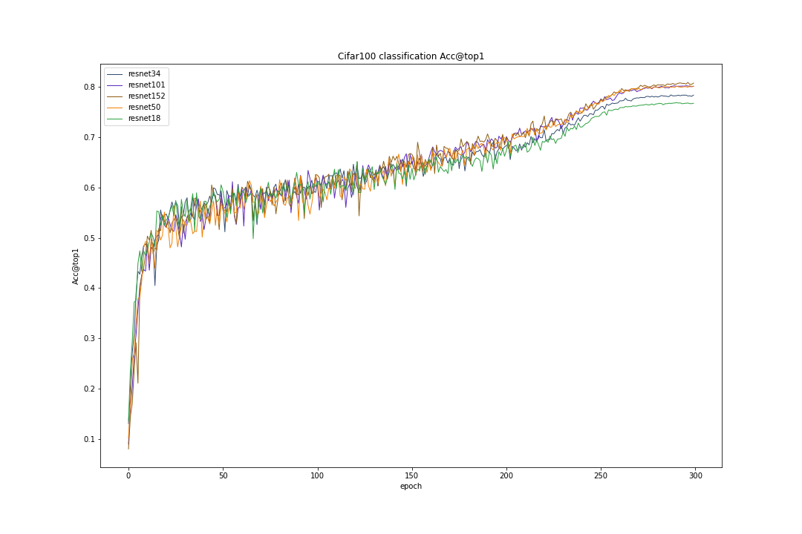
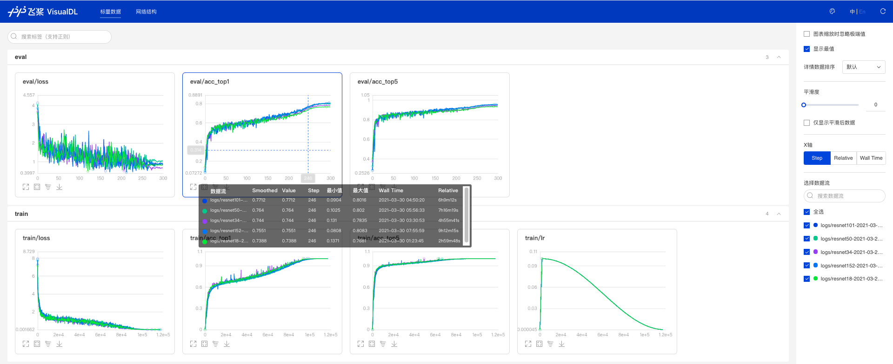

```
██████╗  █████╗ ██████╗ ██████╗ ██╗     ███████╗     ██████╗██╗███████╗ █████╗ ██████╗ 
██╔══██╗██╔══██╗██╔══██╗██╔══██╗██║     ██╔════╝    ██╔════╝██║██╔════╝██╔══██╗██╔══██╗
██████╔╝███████║██║  ██║██║  ██║██║     █████╗      ██║     ██║█████╗  ███████║██████╔╝
██╔═══╝ ██╔══██║██║  ██║██║  ██║██║     ██╔══╝      ██║     ██║██╔══╝  ██╔══██║██╔══██╗
██║     ██║  ██║██████╔╝██████╔╝███████╗███████╗    ╚██████╗██║██║     ██║  ██║██║  ██║
╚═╝     ╚═╝  ╚═╝╚═════╝ ╚═════╝ ╚══════╝╚══════╝     ╚═════╝╚═╝╚═╝     ╚═╝  ╚═╝╚═╝  ╚═╝
```
# PaddlePaddle cifar100
To explore the limit performance of opensource classifier on [CIFAR100](https://www.cs.toronto.edu/~kriz/cifar.html) with [PaddlePaddle](https://github.com/PaddlePaddle/Paddle).

# Repo dynamic
## Relate update
- 2021.05.27: Releases the training of the MnasNet model
- 2021.04.24: Releases the training of the ResNeXt model
- 2021.04.16: Releases the training of the shufflenet series model
- 2021.04.09: Releases the training of the vgg model
- 2021.04.08: Releases the training of the MobileNet v2 model
- 2021.04.07: Releases the training of the MobileNet v1 model
- 2021.04.04: Releases the training of the ViT(vision transformer) variants model
- 2021.03.30: Releases the training of the ResNet series model

## Model results
Some nets might get the best result from other hyperparameters, You can set up other hyperparameters for training.
|  network  | params | top1 Acc | top5 Acc | yaml | 
| :-------: | :----: | :------: | :------: | :-------------: | 
| resnet18 |  11.2M  |  0.7681   |  0.9345   |   common.yml  |  
| resnet34 |  21.3M  |  0.7835   |  0.9439  |   common.yml  |
| resnet50 |  23.8M  |  0.8020   |  0.9530  |   common.yml  | 
| resnet101 |  42.8M  |  0.8016   |  0.9540  |   common.yml  |
| resnet152 |  58.5M  |  0.8083   |  0.9549  |   common.yml  |
| vit_p4_d6_h12_e384 |10.7M |0.5689| 0.8370| vit.yml|
| vit_p4_d6_h12_e192|2.7M|0.5428|0.8207|vit.yml|
|vit_p4_d12_h12_e384|21.4M|0.5570|0.8296|vit.yml|
|vit_p4_d12_h12_e192|5.4M|0.5375|0.8201|vit.yml|
|mobilenetv1 x1.0|3.3M|0.6607|0.8792|mobilenetv1.yml|
|mobilenetv1 x0.75|1.9M|0.6481|0.8646|mobilenetv1.yml|
|mobilenetv1 x0.5|0.88M|0.6095|0.8493|mobilenetv1.yml|
|mobilenetv1 x0.25|0.24M|0.5645|0.8292|mobilenetv1.yml|
|mobilenetv2 x1.0|0.24M|0.677|0.8912|mobilenetv2.yml|
|mobilenetv2 x0.75|1.5M|0.6685|0.8874|mobilenetv2.yml|
|mobilenetv2 x0.5|0.8M|0.6265|0.8631|mobilenetv2.yml|
|mobilenetv2 x0.25|0.38M|0.5631|0.831|mobilenetv2.yml|
|vgg19 BN|39.3M|0.716|0.8997|vgg.yml|
|vgg16 BN|34.0M|0.7174|0.9053|vgg.yml|
|vgg13 BN|28.7M|0.7133|0.9029|vgg.yml|
|vgg11 BN|28.5M|0.6773|0.8808|vgg.yml|
|shufflenet v1 groups3|1.04M|0.6966|0.8975|shufflenetv1.yml|
|shufflenet v2 scale1.0 swish|1.37M|0.7116|0.9116|shufflenetv2.yml|
|shufflenet v2 scale1.0 relu|1.37M|0.6924|0.8952|shufflenetv2.yml|
|swin transformer tiny|6.93M|0.5303|0.7833|swin_transformer.yml|
|resnext50 32x4d|23.2M|0.7744|0.934|common.yml|
|resnext101 32x8d|87.1M|0.7938|0.9407|common.yml|
|mnasnet 1.0|3.3M|0.7039|0.8914|mnasnet.yml|

## Test curve
`csv_dir` download from VisualDL scalar

# Requirements
> python3 -m pip install -r requirements.txt

# Usage
## Training & Evaluation
Training and Evaluation are put together, using PaddlePaddle HighAPI(hapi). To train baseline PaddlePaddle-cifar100-resnet18 on a single gpu for 300 epochs run:
> python3 main.py -c resnet18 -y yamls/common.yml

## Visualization
[VisualDL](https://www.paddlepaddle.org.cn/documentation/docs/zh/guides/03_VisualDL/visualdl.html#visualdl): VisualDL is the PaddlePaddle visual analysis tool.
> visualdl --logdir logs --host 0.0.0.0

VisualDL display details:

# Relevant papers
- ResNet: [Deep Residual Learning for Image Recognition](https://arxiv.org/abs/1512.03385v1)
- Transformer: [Attention is not all you need: pure attention loses rank doubly exponentially with depth](https://link.zhihu.com/?target=https%3A//arxiv.org/abs/2103.03404v1)
- MobileNets: [MobileNets: Efficient Convolutional Neural Networks for Mobile Vision Applications](https://arxiv.org/abs/1704.04861)
- MobileNetV2: [MobileNetV2: Inverted Residuals and Linear Bottlenecks](https://arxiv.org/abs/1801.04381)
- VGG: [Very Deep Convolutional Networks for Large-Scale Image Recognition](https://arxiv.org/abs/1409.1556)
- ShuffleNet: [ShuffleNet: An Extremely Efficient Convolutional Neural Network for Mobile Devices](https://arxiv.org/abs/1707.01083)
- ShuffleNet V2: [ShuffleNet V2: Practical Guidelines for Efficient CNN Architecture Design](https://arxiv.org/abs/1807.11164)
- Swin Transformer: [Swin Transformer: Hierarchical Vision Transformer using Shifted Windows](https://arxiv.org/pdf/2103.14030.pdf)
- ResneXt: [Aggregated Residual Transformations for Deep Neural Networks](https://arxiv.org/abs/1611.05431)
- MnasNet: [MnasNet: Platform-Aware Neural Architecture Search for Mobile](https://arxiv.org/pdf/1807.11626.pdf)