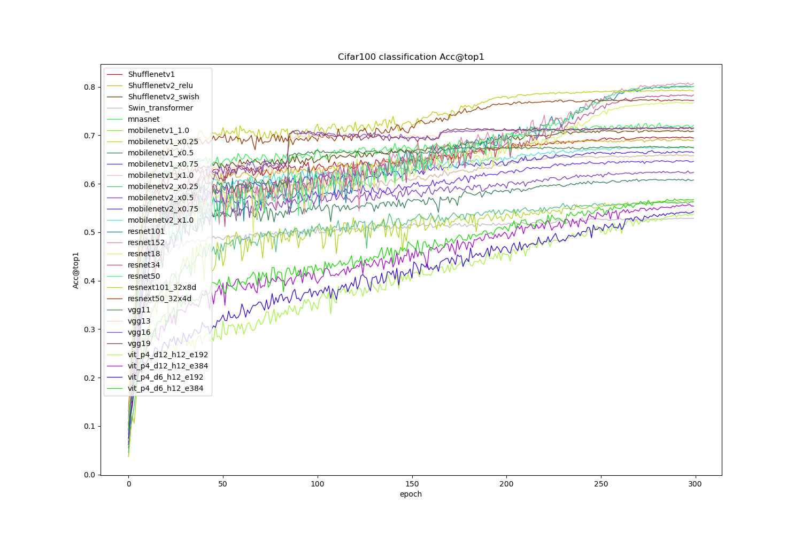

```
██████╗  █████╗ ██████╗ ██████╗ ██╗     ███████╗     ██████╗██╗███████╗ █████╗ ██████╗ 
██╔══██╗██╔══██╗██╔══██╗██╔══██╗██║     ██╔════╝    ██╔════╝██║██╔════╝██╔══██╗██╔══██╗
██████╔╝███████║██║  ██║██║  ██║██║     █████╗      ██║     ██║█████╗  ███████║██████╔╝
██╔═══╝ ██╔══██║██║  ██║██║  ██║██║     ██╔══╝      ██║     ██║██╔══╝  ██╔══██║██╔══██╗
██║     ██║  ██║██████╔╝██████╔╝███████╗███████╗    ╚██████╗██║██║     ██║  ██║██║  ██║
╚═╝     ╚═╝  ╚═╝╚═════╝ ╚═════╝ ╚══════╝╚══════╝     ╚═════╝╚═╝╚═╝     ╚═╝  ╚═╝╚═╝  ╚═╝
```
# PaddlePaddle cifar100
To explore the limit performance of opensource classifier on [CIFAR100](https://www.cs.toronto.edu/~kriz/cifar.html) with [PaddlePaddle](https://github.com/PaddlePaddle/Paddle).

# Repo dynamic
## Informations
- 2021.04.03: Releases the training of the ViT(vision transformer) variants model
- 2021.03.30: Releases the training of the ResNet series model

## Model results
Some nets might get the best result from other hyperparameters, You can set up other hyperparameters for training.
|  network  | params | top1 Acc | top5 Acc | hyperparameters | total epoch |
| :-------: | :----: | :------: | :------: | :-------------: | :---------: |
| resnet18 |  11.2M  |  0.7681   |  0.9345   |   default  |     300     |
| resnet34 |  21.3M  |  0.7835   |  0.9439  |   default  |     300     |
| resnet50 |  23.8M  |  0.8020   |  0.9530  |   default  |     300     |
| resnet101 |  42.8M  |  0.8016   |  0.9540  |   default  |     300     |
| resnet152 |  58.5M  |  0.8083   |  0.9549  |   default  |     300     |
## Test curve
`csv_dir` download from VisualDL scalar

# Requirements
> python3 -m pip install -r requirements.txt

# Usage
## Training & Evaluation
Training and Evaluation are put together, using PaddlePaddle HighAPI(hapi). To train baseline PaddlePaddle-cifar100-resnet18 on a single gpu for 300 epochs run:
> python3 main.py

## Visualization
[VisualDL](https://www.paddlepaddle.org.cn/documentation/docs/zh/guides/03_VisualDL/visualdl.html#visualdl): VisualDL is the PaddlePaddle visual analysis tool.
> visualdl --logdir logs --host 0.0.0.0

VisualDL display details:

# Relevant papers
ResNet: [Deep Residual Learning for Image Recognition](https://arxiv.org/abs/1512.03385v1)
Transformer: [Attention is not all you need: pure attention loses rank doubly exponentially with depth](https://link.zhihu.com/?target=https%3A//arxiv.org/abs/2103.03404v1)
